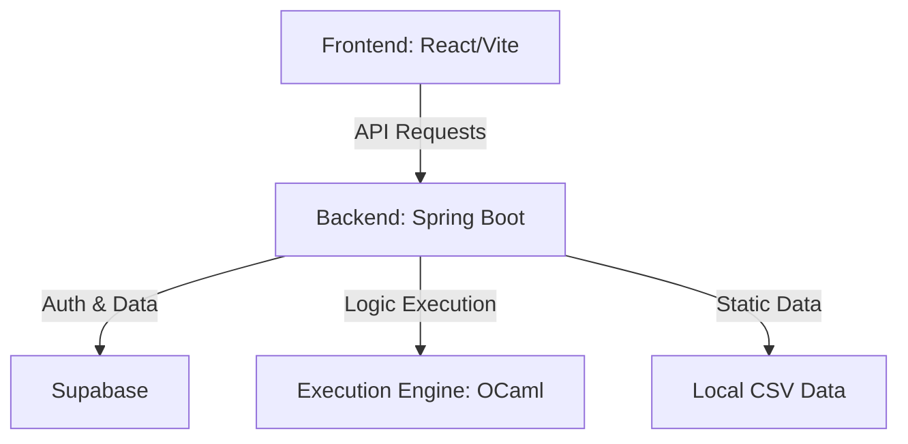

## 🌟 Overview

**SEND** is a cutting-edge financial education platform designed to bridge the gap between theoretical investing and practical strategy development. At its core is a powerful **Node-Based Editor** that allows users to visualize trading logic as interactive graphs, backtest them against historical market data, and master complex financial concepts through gamified learning modules.

### 🚀 Key Features

- 🧩 **Node-Based Strategy Editor**: Build complex trading algorithms visually—no coding required.
- 📈 **Historical Backtesting**: Validate your logic against real-world US market data.
- 🕹️ **Replay Tools**: Step through daily strategy performance to understand every trade and portfolio shift.
- 🎓 **Interactive Modules**: Progress through a curated curriculum that teaches both the platform and investment fundamentals.
- 🔐 **Secure Sandbox**: Experiment with strategies in a risk-free environment.

---

## 🏗️ Architecture



---

## 🛠️ Tech Stack

| Layer | Technologies |
| :--- | :--- |
| **Frontend** | React, Vite, Tailwind CSS, Shadcn UI |
| **Backend** | Java 21, Spring Boot, Spring Security, Hibernate |
| **Execution** | OCaml (High-performance simulation engine) |
| **Infrastructure** | Supabase (PostgreSQL + Auth), Vercel, Docker |

---

## 🚦 Getting Started

### 📦 Prerequisites
- **Java 21** & **Node.js 18+**
- **Supabase Account** (for Auth & Database)
- **Historical Data**: Place required CSV files in the `/data` directory.

### 💻 Local Development (Native Windows)
1. **Clone the Repo**
   ```bash
   git clone https://github.com/mew228/SEND.git
   cd SEND
   ```
2. **Environment Setup**
   Create a `.env` file in the root based on `.env.example`.
3. **Launch Backend**
   ```powershell
   cd backend
   ./run_local.ps1
   ```
4. **Launch Frontend**
   ```bash
   cd frontend
   npm install
   npm run dev
   ```

### 🐳 Docker Deployment
```bash
docker compose up --build
```

---

## 📂 Data Structure
The platform expects the following CSV files in the `/data` directory:
- `us-companies.csv`: Corporate metadata.
- `us-shareprices-daily.csv`: Daily OHLCV data.
- `us-income-quarterly.csv`: Financial statement data.
- `us-balance-quarterly.csv`: Balance sheet data.
- `us-cashflow-quarterly.csv`: Cash flow statements.

---

## 🤝 Contributing
Contributions make the open-source community an amazing place to learn, inspire, and create.
1. Fork the Project
2. Create your Feature Branch (`git checkout -b feature/AmazingFeature`)
3. Commit your Changes (`git commit -m 'Add some AmazingFeature'`)
4. Push to the Branch (`git push origin feature/AmazingFeature`)
5. Open a Pull Request

---

## 🛡️ License & Disclaimer
Distributed under the MIT License. **SEND is an educational tool.** It does not provide financial advice. Real-money decisions are made at your own risk.

